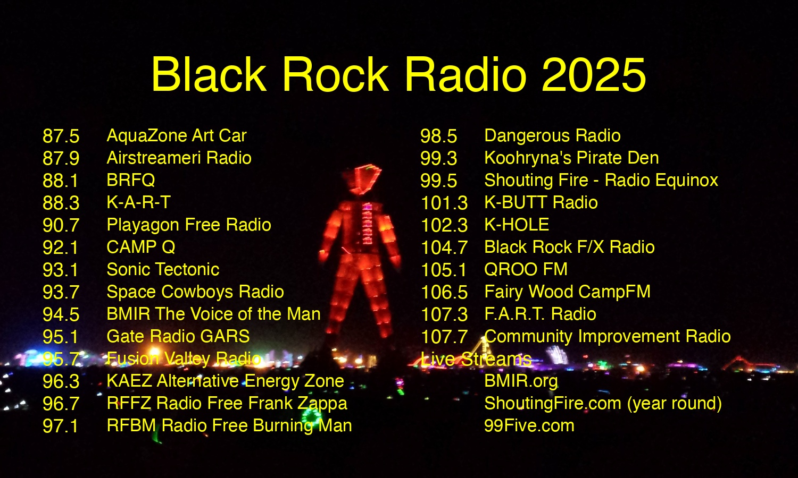

# Black Rock Radio 2025 Guide 📻🔥

Automated radio frequency guide generator for Burning Man 2025, creating print-ready stickers with all the essential radio stations.



## Features

- **🎨 Visual Guide**: Overlays radio frequencies on "The Man" background image
- **📐 Print Ready**: Generates 5"×3" landscape stickers at 300 DPI
- **🤖 Automated**: GitHub Actions automatically updates when frequencies change
- **📚 Wiki Integration**: Auto-publishes to GitHub Wiki with downloadable images
- **🎯 Customizable**: Adjustable fonts, colors, margins, and layouts

## Quick Start

1. **Generate Radio Guide**:

```bash
python3 create_radio_guide.py
```

## Project Structure

```ini
├── create_radio_guide.py    # Main generator script
├── freqs.csv               # station data
└── radio_guide_2025.jpg   # Generated guide
```

## Automation 🤖

### GitHub Actions Workflow

The project includes automated generation via GitHub Actions:

**Triggers**:

- ✅ Automatic: When `freqs.csv` is updated
- ✅ Manual: Via workflow dispatch

**What it does**:

3. 🎨 Generates new radio guide image
4. 📚 Updates GitHub Wiki with:
   - High-resolution downloadable image
   - Print instructions
   - Last updated timestamp

5. 💾 Commits updated image back to repository

### Wiki Access

After automation runs, visit: `https://github.com/astevko/BM_Freaqs/wiki/Radio-Guide`

## Customization

### Fonts & Colors

Edit `create_radio_guide.py`:

```python
font_color = (255, 255, 0, 255)  # Yellow text
title_font = get_font(int(width * 0.06), bold=True)
```

### Margins & Spacing

```python
top_margin = int(height * 0.12)      # Top margin (12%)
title_table_margin = int(height * 0.05)  # Title spacing (5%)
row_margin = int(height * 0.035)     # Row spacing (3.5%)
```

### Transparency

```python
draw.rectangle(bg_rect, fill=(0, 0, 0, 180))  # 180 = 70% opaque
```

## Dependencies

- **Python 3.x**
- **Pillow** (PIL) - Image processing

```bash
pip install -r requirements.txt
```

## Print Specifications

- **Size**: 5" wide × 3" tall (landscape)
- **Resolution**: 1500×900 pixels (300 DPI)
- **Format**: JPEG, high quality
- **Recommended**: Vinyl stickers for weather resistance

## Contributing

1. Fork the repository
2. Update `freqs.csv` with new station data
3. Commit changes (automation will trigger)
4. Check the wiki for updated guide

## License

See [LICENSE](LICENSE) file for details.

---

**🔥 Ready for the playa! Tune on your radio to 87.5 FM! 📻**