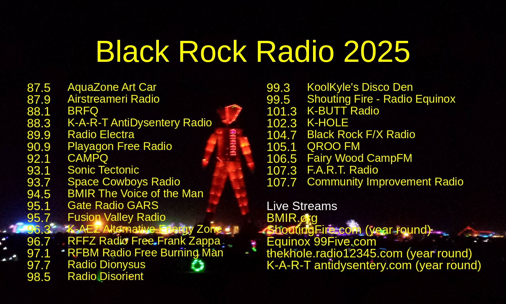

# Black Rock Radio 2025 Guide 📻🔥

Automated radio frequency guide generator for Burning Man 2025, creating print-ready stickers with all the essential radio stations.



## Features

- **🎨 Visual Guide**: Overlays radio frequencies on "The Man" background image
- **📐 Print Ready**: Generates 5"×3" landscape stickers at 300 DPI
- **🤖 Automated**: GitHub Actions automatically updates when frequencies change
- **📚 Wiki Integration**: Auto-publishes to GitHub Wiki with downloadable images
- **🎯 Customizable**: Adjustable fonts, colors, margins, and layouts

## Quick Start

1. **Generate Radio Guide**:
   ```bash
   python3 create_radio_guide.py
   ```

2. **Create Different Sizes**:
   ```bash
   # 5×3 landscape (recommended)
   python3 resize_to_5x3.py
   
   # 3×5 portrait 
   python3 resize_to_3x5.py
   ```

## Project Structure

```
├── create_radio_guide.py    # Main generator script
├── freqs.csv               # Radio station data
├── requirements.txt        # Python dependencies
├── resize_to_5x3.py       # 5×3 landscape formatter
├── resize_to_3x5.py       # 3×5 portrait formatter
├── the-man.jpg            # Original background image
├── the-man-5x3.jpg        # 5×3 cropped version
├── the-man-3x5.jpg        # 3×5 cropped version
└── radio_guide_2025.jpg   # Generated guide
```

## Automation 🤖

### GitHub Actions Workflow

The project includes automated generation via GitHub Actions:

**Triggers**:
- ✅ Automatic: When `freqs.csv` is updated
- ✅ Manual: Via workflow dispatch

**What it does**:
1. 🐍 Sets up Python environment
2. 📦 Installs dependencies (`Pillow`)
3. 🎨 Generates new radio guide image
4. 📚 Updates GitHub Wiki with:
   - High-resolution downloadable image
   - Formatted frequency table
   - Print instructions
   - Last updated timestamp
5. 💾 Commits updated image back to repository

### Wiki Access

After automation runs, visit: `https://github.com/astevko/BM_Freaqs/wiki/Radio-Guide`

## Radio Stations (2025)

| Frequency | Station |
|-----------|---------|
| 87.9 | Airstreameri Radio |
| 88.1 | BRFQ |
| 88.3 | K-A-T |
| 90.7 | Playagon Free Radio |
| 92.1 | CAMPO |
| 93.1 | Sonic Tectonic |
| 93.7 | Space Cowboys Radio |
| 94.5 | BMIR The Voice of the Man |
| 95.1 | Gate Radio GARS |
| 95.7 | Fusion Valley Radio |
| 96.3 | KAEZ Alternative Energy Zone |
| 96.7 | RFZ Radio Free Frank Zappa |
| 97.1 | RFBM Radio Free Burning Man |
| 98.5 | Dangerous Radio |
| 99.3 | Koohryna's Pirate Den |
| 99.5 | Shouting Fire-Radio Equinox |
| 101.3 | K-BUTT Radio. |
| 102.3 | K-HOLE |
| 104.7 | Black Rock F/X Radio |
| 105.1 | QROO FM |
| 106.5 | Fairy Wood CampFM |
| 107.3 | F.A.R.T. Radio |
| 107.7 | Community Improvement Radio |

## Customization

### Fonts & Colors
Edit `create_radio_guide.py`:
```python
font_color = (255, 255, 0, 255)  # Yellow text
title_font = get_font(int(width * 0.06), bold=True)
```

### Margins & Spacing
```python
top_margin = int(height * 0.12)      # Top margin (12%)
title_table_margin = int(height * 0.05)  # Title spacing (5%)
row_margin = int(height * 0.035)     # Row spacing (3.5%)
```

### Transparency
```python
draw.rectangle(bg_rect, fill=(0, 0, 0, 180))  # 180 = 70% opaque
```

## Dependencies

- **Python 3.x**
- **Pillow** (PIL) - Image processing
```bash
pip install -r requirements.txt
```

## Print Specifications

- **Size**: 5" wide × 3" tall (landscape)
- **Resolution**: 1500×900 pixels (300 DPI)
- **Format**: JPEG, high quality
- **Recommended**: Vinyl stickers for weather resistance

## Contributing

1. Fork the repository
2. Update `freqs.csv` with new station data
3. Commit changes (automation will trigger)
4. Check the wiki for updated guide

## License

See [LICENSE](LICENSE) file for details.

---

**🔥 Ready for the playa! Tune in and turn on! 📻** 